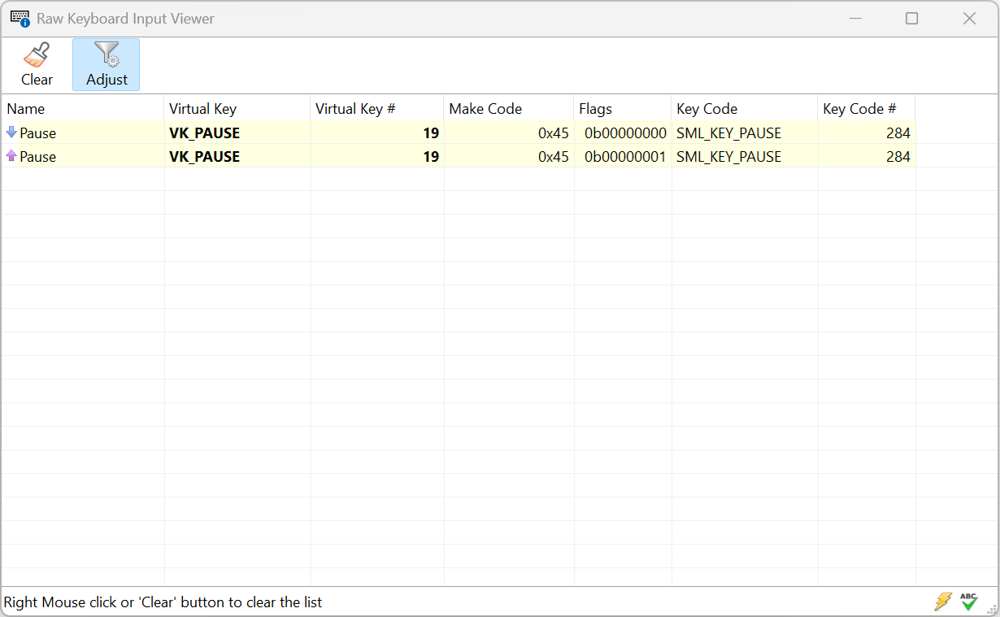

# RawInputViewer 



A utility to test, visualize, and map WM_INPUT messages.

[](https://github.com/RealBitdancer/RawInputViewer/actions/workflows/build_win_msvc.yaml)

# How to Build

This project is written using **Visual Studio 2022** with **C++23** enabled and utilizes new C++ features like concepts and ranges.

## What You Need
- **Visual Studio 2022**: Ensure the `Desktop development with C++` workload is installed.

## Steps
1. **Clone the code from GitHub**
   ```cmd
   git clone https://github.com/RealBitdancer/RawInputViewer.git && cd RawInputViewer
   ```
2. **Create a build folder**
   ```cmd
   mkdir build && cd build
   ```
3. **Run CMake**

   Pick your flavor:

* **64 Bit:**
   ```cmd
   cmake .. -G "Visual Studio 17 2022" -A x64
   ```
* **32 Bit:**
   ```cmd
   cmake .. -G "Visual Studio 17 2022" -A Win32
   ```
4. **Open in Visual Studio**
   ```cmd
   start RawInputViewer.sln
   ```
5. **Build and Run**

   In Visual Studio, pick `Debug` or `Release`, then hit `F5` or `Ctrl+F5`.

# Background
During my work on a personal graphics library (SML), I ran repeatedly into issues with WM_INPUT. To quickly test input on different systems, I put together a quick and dirty C++ Windows desktop app that was really only meant for myself. While reading up on the topic of WM_INPUT, I realized that this tool might be useful for other folks who struggle with the quirks of WM_INPUT, so I sat down and polished it a little to avoid completely embarrassing myself. So, here we are, enjoy `RawInputViewer`.

# Attribution

This project's icons and bitmaps have been sourced from and assembled with [Axialis IconWorshop](https://www.axialis.com/iconworkshop)
