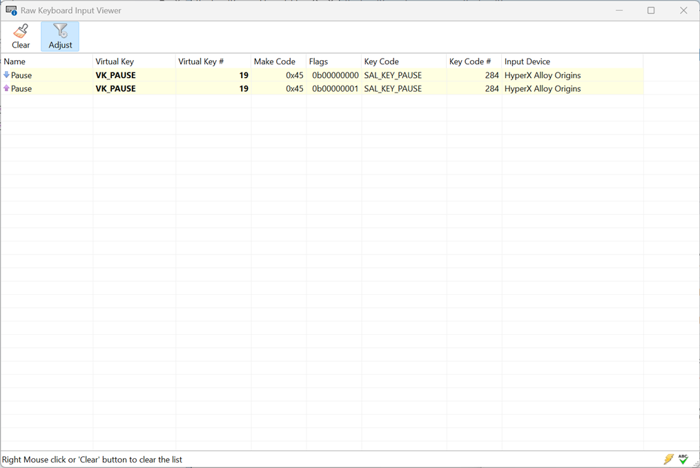

# RawInputViewer



A utility to test, visualize, and map WM_INPUT messages. Windows only.

[](https://github.com/RealBitdancer/RawInputViewer/actions/workflows/build_win_msvc.yaml)

## What it does

RawInputViewer listens for [`WM_INPUT`](https://learn.microsoft.com/en-us/windows/win32/inputdev/wm-input)
keyboard messages and shows each event in a list view: virtual key, scan code, flags, SAL,
Raylib, and GLFW key name mappings, and (since 1.1.0) which physical device sent the input.

## Download

Ready made Windows binaries are attached to [GitHub Releases](https://github.com/RealBitdancer/RawInputViewer/releases):

| File | Description |
|------|-------------|
| `RawInputViewer-x64.exe` | 64 bit Windows (recommended) |
| `RawInputViewer-x86.exe` | 32 bit Windows |

Download and run. If SmartScreen complains, choose `More info` and then `Run anyway`. The
release builds are not code signed. To compile your own copy, see [How to Build](#how-to-build).

## Using the app

Press keys on any connected keyboard. Each key down and key up appears as a new row. Values
that **Adjust** mode changed are drawn in **bold**.

Clear the list with the **Clear** button on the main toolbar, or with a right click anywhere.
The app registers for raw mouse input and treats a right button release as clear.

### Main toolbar

| Button | Type | Description |
|--------|------|-------------|
| **Clear** | action | Removes every row from the list and resets internal key sequence state. |
| **Adjust** | toggle (on by default) | Normalizes raw keyboard data before display. It fills in missing make codes from the virtual key, handles E0 and E1 scan code sequences, tells left from right Shift, Ctrl, and Alt, and resolves Pause/Break versus Num Lock on scan code `0x45`. Turn it off to see the unmodified `RAWINPUT` keyboard fields. |

### Status bar (right side)

These toggles call `RegisterRawInputDevices` again with different flags. Both start checked,
which matches ordinary Windows behavior.

| Button | Type | Checked (default) | Unchecked |
|--------|------|-------------------|-----------|
| **No Hotkeys** | toggle | System hotkeys such as Alt+Tab behave normally. | `RIDEV_NOHOTKEYS` is set. Hotkey combinations reach this app as raw keyboard input instead of triggering the system action. |
| **No Legacy** | toggle | Legacy `WM_KEY*` and `WM_MOUSE*` messages are still generated alongside raw input. | `RIDEV_NOLEGACY` is set. Legacy keyboard and mouse messages for the registered devices are suppressed. |

If re-registration fails, the toggle returns to its previous state.

### List view column headers

Click the arrow on a numeric column header to change the display format where that is supported:

- **Decimal**, **Hexadecimal**, or **Binary** for virtual key, make code, flags, and key code columns
- **SAL**, **Raylib**, or **GLFW** for the key code name column

Window size, column widths, and display formats are saved under `HKEY_CURRENT_USER` and
restored on the next launch.

## How to Build

Build on Windows with Visual Studio. There is no Linux or macOS port and no cross compilation.
The x64 and x86 binaries both come from native MSVC on the same machine, using different CMake
architecture presets.

The project uses **Visual Studio** with **C++23** and modern C++ features such as concepts and
ranges.

### What you need

- **Visual Studio 2022 or newer** with the `Desktop development with C++` workload installed.

### Steps

1. **Clone the repository**
   ```cmd
   git clone https://github.com/RealBitdancer/RawInputViewer.git && cd RawInputViewer
   ```
2. **Configure with CMake**

   The Visual Studio generator comes from the host default, so any installed version will do.

   64 bit:
   ```cmd
   cmake --preset default
   ```
   32 bit:
   ```cmd
   cmake --preset msvc-x86
   ```
3. **Build**

   From the command line:
   ```cmd
   cmake --build --preset release
   ```
   Presets are `debug`, `release`, `x86-debug`, and `x86-release`.

   Or open the generated solution in Visual Studio, choose `Debug` or `Release`, and press `F5`
   or `Ctrl+F5`:
   ```cmd
   start build\msvc-x64\RawInputViewer.sln
   ```
   Recent CMake and Visual Studio versions may produce `RawInputViewer.slnx` instead of
   `RawInputViewer.sln`.

## Background

While working on a personal platform abstraction library (SAL), I kept running into WM_INPUT
quirks. I wrote a small Windows desktop program to test keyboard input on different machines.
It was meant for my own use. After reading more about raw input, I thought others wrestling
with the same API might find it useful, so I cleaned it up enough to show in public. Here it is.

## Attribution

Icons and bitmaps were assembled with [Axialis IconWorshop](https://www.axialis.com/iconworkshop).

## License

MIT. See [LICENSE](LICENSE). Copyright (c) 2025-2026 Bitdancer (github.com/RealBitdancer).

See also [Changelog](CHANGELOG.md), [Contributing](CONTRIBUTING.md), and [Security](SECURITY.md).
